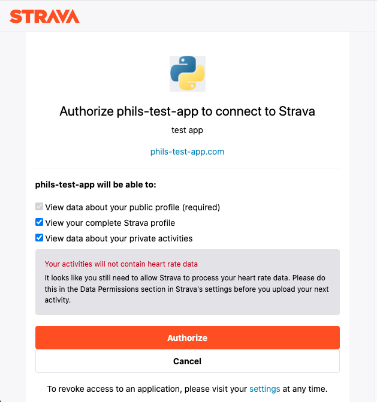

# Python script to get your activities from Strava.

# Step 1 - Create App with Strava
- Go to https://www.strava.com/settings/api and create an App
- Can use fake website domain
- Set `Authorization Callback Domain` to localhost

# Step 2 - Note down client details and secrets
- create a `.env` file in this directory, and save the variables below to this file
```
CLIENT_ID=REPLACE_ME
CLIENT_SECRET=REPLACE_ME
TOKEN_FROM_URL=REPLACE_ME
```
# Step 3 - Run python script
- Script will prompt user to open a link with Strava. This will grant the user access to read all of the users Profile and Activies details
  - 
- Click the promted link, and click `Authorize`
  - 
- Copy the url of the redirected page, and paste into the terminal where python is running
- Scirpt will collect activities from strava and save to a csv file, `strava_activities.csv`.